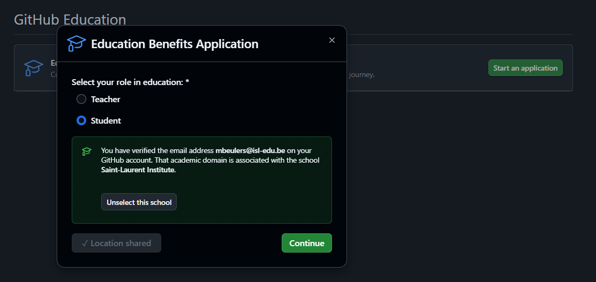
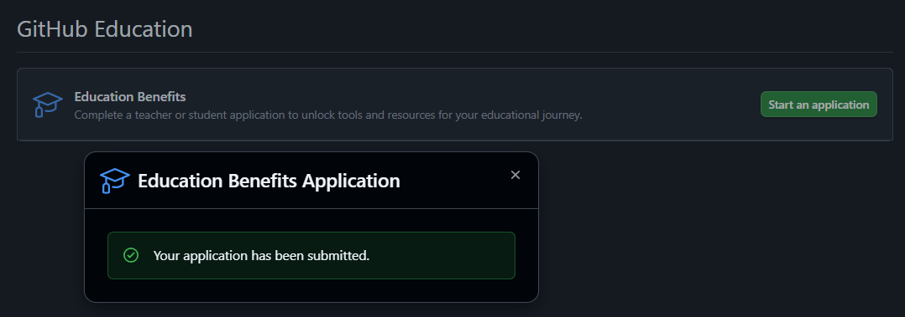
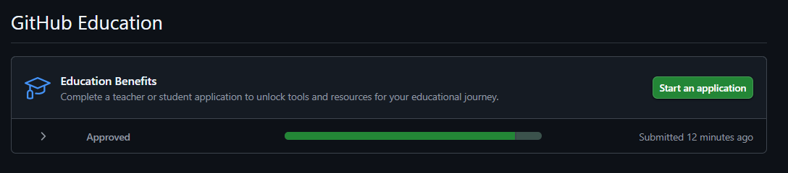

# 🎓 GitHub Student Developer Pack

Le GitHub Student Pack vous donne accès gratuitement à de nombreux outils de développement utilisés par les professionnels. Voici comment l’obtenir :

---

## 1) Ajouter votre email scolaire à GitHub

➡️ Rendez-vous dans vos paramètres [GitHub → Emails](https://github.com/settings/emails).

➡️ Cliquez sur Add email address et entrez votre adresse scolaire.

---

## 2) Vérifier votre email scolaire

Allez vérifier votre boîte mail scolaire (connexion via [Microsoft Online](https://login.microsoftonline.com/common/login)) et cliquez sur le lien de confirmation envoyé par GitHub.

---

## 3) Faire la demande du pack étudiant

Allez sur la page [GitHub Education Benefits](https://github.com/settings/education/benefits).
Choisissez Student, puis suivez les étapes.

## 4) Valider et attendre

Votre demande est soumise. Il faut attendre que GitHub la valide (cela peut prendre quelques heures à quelques jours).

## 5) 🎉 Profitez !

Vous aurez accès à des outils gratuits comme :

- Visual Studio Code Pro
- Namecheap (nom de domaine)
- GitHub Copilot
- et plein d’autres logiciels et services.

